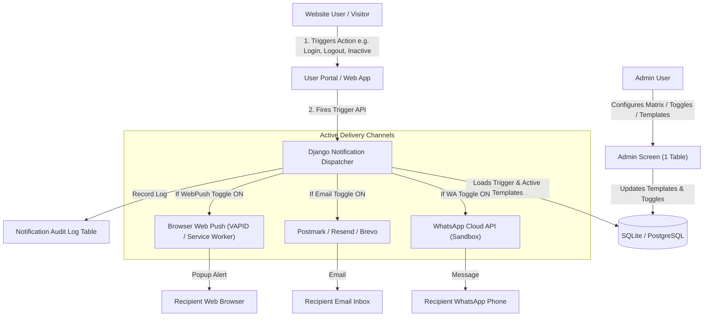

# Omni-Channel Notification Management System

> **A single-screen admin dashboard to configure, edit, toggle, and test-send notifications across WhatsApp, Email, and Web Push.**
> Built with **Python + Django REST Framework** (Backend) and **React + Tailwind CSS** (Frontend).
> Ready for deployment on **Render** (Backend) and **Vercel** (Frontend).

---

## 🚀 Key Highlights & Architecture

- **Single-Screen Admin Matrix**: Row = Trigger event, Column = Delivery Channel (WhatsApp, Email, Web Push). Admins configure everything in one table without logging into Meta, Postmark, or Push provider consoles.
- **Three Supported Channels**:
  1. **WhatsApp Cloud API** (Meta Sandbox with temporary token & test recipient support).
  2. **Transactional Email** (Postmark, Resend, or Brevo REST APIs).
  3. **Web Push** (Standard W3C VAPID Web Push with Service Worker for instant browser pop-ups, plus optional OneSignal).
- **Dynamic Variable Interpolation**: Use `{{username}}`, `{{email}}`, `{{time}}`, `{{order_id}}`, etc. across all channel templates.
- **Instant Cell Controls**: Each cell has a live **ON / OFF toggle**, **Template Editor** with dynamic variable chips, **Live Preview**, and **Test Send** modal.
- **Interactive User Playground**: Simulate real user actions (Login, Logout, Inactivity 1 Day, Inactivity 1 Week, Password Reset, Order Placed) to observe omni-channel notifications firing in real time.
- **Comprehensive Audit Logs**: Inspect exact outgoing payloads, HTTP response codes, and diagnostic troubleshooting hints.



---

## 📋 System Design & Concepts

### 1. Triggers (When a notification fires)
A **trigger** is any event or condition on the website that causes notifications to go out:
- **Login**: User signs in on the website.
- **Logout**: User signs out of their session.
- **Not logged in for 1 day**: User has not visited the website for 24 hours.
- **Not logged in for 1 week**: User has not visited the website for 7 days.
- **Password reset**: User asks to reset credentials.
- **Order placed**: User completes a purchase.
- **Custom Triggers**: Admins can add unlimited custom triggers directly from the "+ Add New Trigger" button.

### 2. Channels (Where the message goes)
| Channel | What the user gets | Service Used |
| :--- | :--- | :--- |
| **WhatsApp** | Message on WhatsApp phone | **WhatsApp Cloud API** (Meta Sandbox) |
| **Email** | Transactional email in inbox | **Postmark** (or Resend / Brevo) |
| **Web Push** | Pop-up in the browser | **Web Push API** (W3C VAPID + Service Worker) / OneSignal |

---

## 🛠️ Project Structure

```
Notification system/
├── backend/
│   ├── manage.py
│   ├── requirements.txt
│   ├── Procfile                  # Render web process definition
│   ├── render.yaml               # Render infrastructure Blueprint
│   ├── build.sh                  # Render build & migration script
│   ├── .env.example              # Backend environment variables
│   ├── notification_core/
│   │   ├── settings.py           # Django settings (CORS, REST, Providers)
│   │   ├── urls.py               # Main URL router
│   │   ├── wsgi.py
│   │   └── asgi.py
│   └── notifications/
│       ├── models.py             # Trigger, ChannelTemplate, NotificationLog, WebPushSubscription
│       ├── views.py              # REST API ViewSets & Auth endpoints
│       ├── serializers.py        # Matrix serializers & validation
│       ├── urls.py               # API endpoints
│       ├── services/
│       │   ├── notification_dispatcher.py  # Central dispatch engine
│       │   ├── whatsapp_service.py         # Meta WhatsApp Cloud API client
│       │   ├── email_service.py            # Postmark, Resend, Brevo client
│       │   └── webpush_service.py          # Native VAPID Web Push client
│       ├── management/commands/
│       │   ├── seed_data.py                # Pre-seeds demo triggers & admin user
│       │   └── check_inactivity_triggers.py # Periodic inactivity checker
│       └── tests.py              # Automated test suite
│
├── frontend/
│   ├── package.json
│   ├── vite.config.js
│   ├── vercel.json               # Vercel deployment rewrites
│   ├── .env.example
│   ├── public/
│   │   ├── sw.js                 # Service Worker for native Web Push
│   │   └── favicon.svg
│   └── src/
│       ├── main.jsx
│       ├── App.jsx               # Main state & layout
│       ├── api.js                # Fetch API client
│       ├── index.css             # Tailwind CSS styles
│       └── components/
│           ├── Navbar.jsx                  # Top navigation & provider status
│           ├── NotificationMatrixTable.jsx # Central 1-screen matrix table
│           ├── TemplateModal.jsx           # Template editor & live preview
│           ├── TestSendModal.jsx           # Single-cell test dispatcher
│           ├── TriggerModal.jsx            # Create custom trigger
│           ├── NotificationLogs.jsx        # Audit log inspector
│           ├── UserPortal.jsx              # Consumer website trigger simulator
│           └── TaskDExplanationModal.jsx   # Interview verbal Q&A flashcards
│
└── README.md
```

---

## ⚙️ Quickstart (Local Development)

### 1. Backend Setup (Django)

```bash
cd backend

# Create and activate virtual environment
python -m venv venv
# On Windows:
.\venv\Scripts\activate
# On Linux/macOS:
source venv/bin/activate

# Install dependencies
pip install -r requirements.txt

# Run migrations
python manage.py migrate

# Seed initial triggers, templates, and admin user
python manage.py seed_data

# Run development server
python manage.py runserver
```

> **Default Admin Credentials:**
> - Username: `admin`
> - Password: `admin123`
> - Backend will run on: `http://127.0.0.1:8000/`

### 2. Frontend Setup (React + Vite)

```bash
cd frontend

# Install node dependencies
npm install

# Start Vite dev server
npm run dev
```

> Frontend will run on: `http://localhost:5173/`

---

## 🔑 Environment Variables & Sandbox Setup

### Backend `.env` (`backend/.env`):

```ini
SECRET_KEY=django-insecure-notification-system-secret-key
DEBUG=True
ALLOWED_HOSTS=*
CORS_ALLOW_ALL_ORIGINS=True

# 1. WhatsApp Cloud API (Meta Sandbox)
# From developers.facebook.com -> WhatsApp -> API Setup
WHATSAPP_ACCESS_TOKEN=your_meta_temporary_access_token
PHONE_NUMBER_ID=your_meta_phone_number_id
WHATSAPP_DEFAULT_TEST_PHONE=+1234567890

# 2. Email Service (Postmark / Resend / Brevo)
# Named in assignment doc: Postmark
POSTMARKAPP_TOKEN=your_postmark_server_token
POSTMARK_FROM_EMAIL=your_verified_sender@example.com

# Alternative free transactional email APIs:
RESEND_API_KEY=
RESEND_FROM_EMAIL=onboarding@resend.dev

BREVO_API_KEY=
BREVO_FROM_EMAIL=your_verified_brevo_sender@example.com

# 3. Web Push (VAPID / Browser Push)
# Pre-configured development keys (or generate with pywebpush)
VAPID_PUBLIC_KEY=BEl62iUYgUivxIkv69yViEuiBIa-Ib9-SkvMeAtA3LFgDzkrxZJjSgSnfckjBJuBkr3qBUYIHBQFLXYp5Nksh8U
VAPID_PRIVATE_KEY=UUx12SmvGWjhqdStw-myVn_E-1jN7S767Jg6-25-83c
VAPID_ADMIN_EMAIL=mailto:admin@example.com

# Optional OneSignal API:
ONESIGNAL_APP_ID=
ONESIGNAL_REST_API_KEY=
```

### Sandbox Providers Quick Guide:
1. **WhatsApp Cloud API (Sandbox)**:
   - Create a free app at [developers.facebook.com](https://developers.facebook.com).
   - Add the WhatsApp product and open **API Setup**.
   - Copy the **Temporary access token** and **Phone number ID**.
   - Under **To**, add your personal phone number to the *Allowed Test Recipients* list and verify via OTP.
   - Paste `WHATSAPP_ACCESS_TOKEN` and `PHONE_NUMBER_ID` into `backend/.env`.
   - *Note:* If token is missing, the backend runs in realistic **Sandbox Simulation Mode**, logging the exact payload.

2. **Email (Postmark)**:
   - Sign up at [postmarkapp.com](https://postmarkapp.com) (free tier gives 100 transactional emails).
   - Create a server and verify your sender email.
   - Copy Server API Token into `POSTMARKAPP_TOKEN` and set `POSTMARK_FROM_EMAIL`.
   - Alternatively, use **Resend** (`RESEND_API_KEY`) or **Brevo** (`BREVO_API_KEY`).

3. **Web Push**:
   - The project includes **full W3C VAPID Web Push** right out of the box with `pywebpush` and `sw.js`.
   - In the frontend, click the **"🔔 Subscribe Web Push"** button in the navbar and grant browser notification permissions.
   - Pop-up notifications will appear on your desktop browser!

---

## 🌐 Deployment Instructions

### Deploy Backend to Render:
1. Push your repository to GitHub.
2. In [Render Dashboard](https://dashboard.render.com), click **New +** &rarr; **Blueprint** (or **Web Service**).
3. Connect your repository.
4. Settings if setting up as Web Service:
   - **Root Directory**: `backend`
   - **Environment**: `Python 3`
   - **Build Command**: `./build.sh`
   - **Start Command**: `gunicorn notification_core.wsgi:application --bind 0.0.0.0:$PORT`
5. Add Environment Variables from your `.env` (e.g. `WHATSAPP_ACCESS_TOKEN`, `PHONE_NUMBER_ID`, `POSTMARKAPP_TOKEN`, `POSTMARK_FROM_EMAIL`, `VAPID_PUBLIC_KEY`, `VAPID_PRIVATE_KEY`).

### Deploy Frontend to Vercel:
1. In [Vercel Dashboard](https://vercel.com), click **Add New** &rarr; **Project**.
2. Select your GitHub repository.
3. Set **Root Directory** to `frontend`.
4. Framework preset: **Vite**.
5. Add Environment Variable:
   - `VITE_API_URL`: Your live Render backend API URL (e.g. `https://notification-system-backend.onrender.com/api`).
6. Click **Deploy**.

---

## 📝 Practice Tasks Verification Guide

### Task A — Pick any trigger (e.g. Login)
1. Open the Admin Matrix table and locate the **Login** row.
2. Verify all three channels:
   - **WhatsApp**: Click "Edit", verify text, click "Sync Approval" &rarr; approved. Click "Test Send" to your verified phone.
   - **Email**: Click "Edit", set subject and body &rarr; save. Click "Test Send" to your email.
   - **Web Push**: Ensure push is subscribed in navbar. Click "Test Send" &rarr; native browser notification pops up.
3. ✅ **Pass condition**: Received test notifications on phone, email, and browser.

### Task B — Second trigger (e.g. Logout or Not logged in 1 week)
1. Locate the **Logout** or **Not logged in 1 week** row.
2. Customize the templates with different wording.
3. Test send across all three channels.
4. ✅ **Pass condition**: Second row has three distinct working templates tested.

### Task C — Edit and Toggle
1. Click **Edit** on any template cell &rarr; modify message body text &rarr; test send again to verify changes reflect.
2. Click the **ON/OFF toggle** on one channel (e.g. Email) to turn it **OFF**.
3. Fire the trigger (via "Fire All" or from the User Playground).
4. Verify in **Delivery Logs** that the turned-off channel is marked as `Skipped (OFF)`.
5. Turn the toggle back **ON** and verify delivery resumes.

### Task D — Verbal Explanation Guide (For Video Narration)

Click the **Task D Q&A** button in the dashboard navigation for an on-screen reference during your screen recording:

1. **What is a trigger? Give 3 examples (not only login).**
   > *"A trigger is any website event or user condition that automatically initiates a notification. It defines **when** a message should be sent. Three examples are: (1) **User Logout** to confirm session termination; (2) **Not logged in for 1 week**—an inactivity condition to re-engage dormant users; and (3) **Order Placed**—a transactional checkout completion event."*

2. **What are the three channels?**
   > *"The three channels define **where** the message is delivered: (1) **WhatsApp** delivers instant mobile text/template messages via Meta Cloud API; (2) **Email** delivers transactional emails to user inboxes via Postmark; and (3) **Web Push** sends native browser pop-up alerts directly to desktop or mobile browsers."*

3. **Why create templates in admin panel instead of Postmark / WhatsApp site?**
   > *"Creating templates directly in the admin panel gives us a **single source of truth**—admins manage all channels from one matrix table without juggling multiple vendor dashboards. It provides **unified dynamic variables** (like `{{username}}` and `{{time}}`), **instant on/off toggles** without code changes, and **decouples our codebase from providers** so we can switch backends (e.g., Postmark to Resend) effortlessly."*

4. **What is Web Push?**
   > *"Web Push is an open W3C browser technology using Service Workers and the Push API that lets websites send real-time pop-up notifications to users' browsers, even when the website is not actively in focus or the tab is closed, without needing a mobile app."*

---

## 🎥 Walkthrough Video Recording Checklist

When recording your narrated video (Loom / YouTube Unlisted / Google Drive):
- [ ] Show the **Admin Matrix screen** and explain how rows represent Triggers and columns represent Channels.
- [ ] Demonstrate **editing a template** and inserting dynamic variables (`{{username}}`, `{{time}}`).
- [ ] Demonstrate using the **ON/OFF toggle** for a channel.
- [ ] Perform a **Test Send** for WhatsApp, Email, and Web Push.
- [ ] Switch to the **User Playground tab**: perform Login and Logout, showing notifications firing automatically.
- [ ] Open the **Delivery Logs tab**: show the audit trail with provider responses.
- [ ] Open the **Task D Q&A** modal and narrate answers to the 4 questions clearly.
