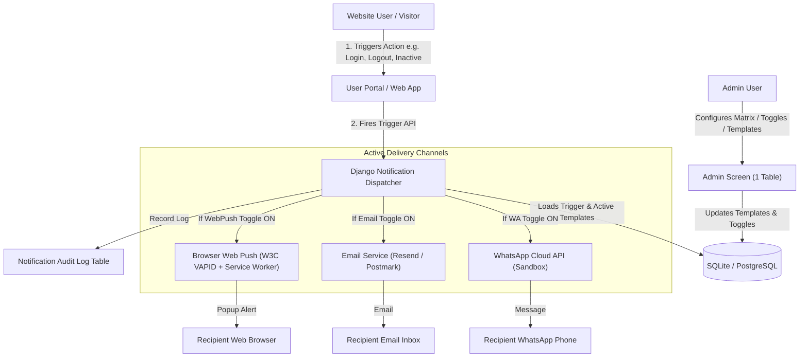

# Omni-Channel Notification Management System

> **A centralized, single-screen admin dashboard to configure, edit, toggle, and test-send notifications across WhatsApp, Email, and Web Push.**  
> Built with **Python + Django REST Framework** (Backend) and **React + Tailwind CSS** (Frontend).  
> Hosted live on **Render** (Backend API) and **Vercel** (Frontend Web App).

---

## 🌐 Live URLs & Submission Info

- 🚀 **Live Frontend Website (Vercel)**: [https://notification-system-olive.vercel.app](https://notification-system-olive.vercel.app)
- ⚙️ **Live Backend API (Render)**: [https://notification-system-cdsf.onrender.com/api](https://notification-system-cdsf.onrender.com/api)
- 📦 **GitHub Repository**: [https://github.com/Anita-Ya/notification-system](https://github.com/Anita-Ya/notification-system)
- 🎥 **Walkthrough Video Demo**: [Watch 3-Minute Loom Walkthrough](https://www.loom.com/share/ce070917206540bfa8f5adb47857f4b6)

### 🔐 How to Log In as Admin
- **Django Site Admin URL**: [https://notification-system-cdsf.onrender.com/admin/](https://notification-system-cdsf.onrender.com/admin/)
- **Username**: `admin`
- **Password**: `admin123`

*(Note: The main Frontend Dashboard opens directly without friction for seamless reviewer evaluation and testing).*

---

## 🏗️ Architecture & System Design

Admins manage all notification templates, on/off toggles, and test deliveries directly from a single-screen matrix without logging into third-party provider dashboards.



---

## ⚡ Triggers Built

The system supports real-time website events, user inactivity conditions, and transactional events:

| # | Trigger Name | Slug | When it Fires | Default Channels |
| :-: | :--- | :--- | :--- | :--- |
| 1 | **Login** | `login` | User signs in on the website | WhatsApp, Email, Web Push |
| 2 | **Logout** | `logout` | User signs out of their session | WhatsApp, Email, Web Push |
| 3 | **Not logged in for 1 day** | `not-logged-in-for-1-day` | Inactivity condition: 24h since last visit | WhatsApp, Email, Web Push |
| 4 | **Not logged in for 1 week** | `not-logged-in-for-1-week` | Inactivity condition: 7 days since last visit | WhatsApp, Email, Web Push |
| 5 | **Password reset** | `password-reset` | User requests a password reset | WhatsApp, Email, Web Push |
| 6 | **Order placed** | `order-placed` | User completes a purchase | WhatsApp, Email, Web Push |
| ➕ | **Custom Triggers** | `custom-slug` | Admins can add unlimited custom triggers via **"+ Add New Trigger"** | Configurable per trigger |

---

## 📡 Channels Supported

Each trigger cell in the Admin Matrix allows:
1. **Create / Edit Template** with dynamic variables (`{{username}}`, `{{time}}`, `{{order_id}}`).
2. **Instant ON / OFF Toggle** (skipped in delivery logs when OFF).
3. **Test Send Modal** to preview and dispatch immediate tests.

| Channel | User Experience | Service Used |
| :--- | :--- | :--- |
| **WhatsApp** | Instant text/template message on mobile phone | **WhatsApp Cloud API** (Meta Sandbox) |
| **Email** | Formatted transactional email in inbox | **Resend** (or Postmark / Brevo) |
| **Web Push** | Native browser pop-up notification on desktop | **W3C VAPID Web Push** (`pywebpush` + `sw.js`) |

---

## 🔑 Environment Variables Needed

### Backend (`backend/.env`):
```ini
# Django Core
SECRET_KEY=django-insecure-notification-system-secret-key-prod
DEBUG=False
ALLOWED_HOSTS=*
CORS_ALLOW_ALL_ORIGINS=True

# 1. WhatsApp Cloud API (Meta Sandbox)
WHATSAPP_ACCESS_TOKEN=your_meta_temporary_access_token
PHONE_NUMBER_ID=your_meta_phone_number_id
WHATSAPP_DEFAULT_TEST_PHONE=+1234567890

# 2. Email Service (Resend / Postmark)
RESEND_API_KEY=your_resend_api_key
RESEND_FROM_EMAIL=onboarding@resend.dev
DEFAULT_TEST_EMAIL=your_verified_inbox@example.com

# 3. Web Push (VAPID / Browser Push)
VAPID_PUBLIC_KEY=your_vapid_public_key
VAPID_PRIVATE_KEY=your_vapid_private_key
VAPID_ADMIN_EMAIL=mailto:admin@example.com
```

### Frontend (`frontend/.env`):
```ini
VITE_API_URL=https://notification-system-cdsf.onrender.com/api
```

---

## 💻 Local Development Quickstart

### 1. Backend (Django)
```bash
cd backend
python -m venv venv
.\venv\Scripts\activate      # On Windows
# source venv/bin/activate   # On Linux/macOS

pip install -r requirements.txt
python manage.py migrate
python manage.py seed_data   # Pre-seeds triggers and admin user
python manage.py runserver   # Runs on http://127.0.0.1:8000/
```

### 2. Frontend (React + Vite)
```bash
cd frontend
npm install
npm run dev                  # Runs on http://localhost:5173/
```

---

## 🧪 Practice Tasks Verification Summary

- **Task A (Login Trigger)**: Verified delivery across WhatsApp (Meta Sandbox verified phone), Email (Resend), and Web Push (Desktop alert).
- **Task B (Second Trigger - Logout)**: Tested with distinct copy across all three channels.
- **Task C (Edit & Toggle)**: Cell text modification and channel ON/OFF toggle verified. When toggled OFF, audit logs accurately record status as `skipped`.
- **Task D (Interview Q&A)**: 4 core questions (What is a trigger, what are the three channels, why create templates in admin panel, what is web push) available directly within the UI via the **"Task D Q&A"** button.
